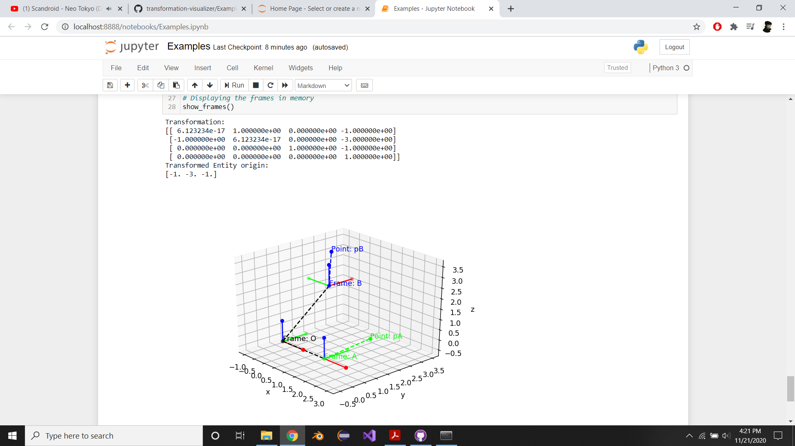

# transformation-visualizer
 This package helps visualizing transformations and the relative transforations between frames

# Requirements
- Anaconda

# Features
- Visualize transformations in interactive plots 
- Print transformations of frames and points as seen from any other frame

